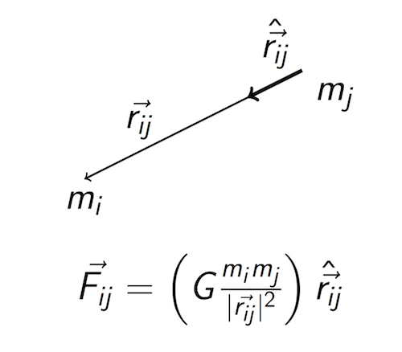

# Newtonian

Newtonian physics gives a way to predict the future state of a system of massive objects in a Euclidean space. This gem provides a library of classes such as Point, Vector, Force. This gem enables a system built from these classes to be evolved forward in time according to Newton's laws of motion.

Note: all bold quantities are vectors. SI units are assumed everywhere, here's a brief list in case you don't remember all the SI units:

 - Time is measured in seconds (s)
 - Length is measured in meters (m)
 - Mass is measured in kilograms (kg)

There are more, but none are relevant to the newtonian library, it only deals with space, time and mass.

The unit for force is sometimes abbreviated (N), as Newtons, but it is defined in terms of kilograms, meters and seconds.

## Newton's laws of motion

1. An object either remains at rest or continues to move at a constant velocity
unless acted upon by a force.

2. The vector sum of external forces **F** acting on an object is equal to the object's mass m
times the acceleration vector **a**.

3. When one body exerts a force on another body, the other body exerts an equal and opposite force on the original body.

The second law can be summarized as:

### **F** = m **a**

The third law can be summarized as:

### **F<sub>1</sub>** = -**F<sub>2</sub>**

## Conservation of momentum

Newton derived the conservation of momentum from his three laws, but later developments in physics, such as electromagnetism and quantum mechanics show that conservation of momentum is actually the more fundamental principle, so I will state it here axiomatically.

Momentum is usually denoted with a **p**, and it is defines as the product of an objects mass and velocity:

**p** = m**v**

Newton's second and third laws can also be summarized as

**F** = (d/dt)**p**

Where (d/dt) means the "rate of change with respect to time". If you are not familiar with calculus, this is called a [derivative](https://en.wikipedia.org/wiki/Derivative).

## Newton's law of universal gravitation

Given two objects with masses m<sub>1</sub> and m<sub>2</sub>, the force of gravity on object two from object one is:

**F<sub>21</sub>** = (Gm<sub>1</sub>m<sub>2</sub>/r<sup>2</sup>)**r&#770;<sub>21</sub>**

Where r = ||**r<sub>21</sub>**||   (the norm (length) of the vector from object 2 to object 1), and

**r&#770;<sub>21</sub>** is a vector in the direction of **r<sub>21</sub>**, but with a magnitude (norm) of 1.

And G is the gravitational constant:  6.673×10<sup>−11</sup> N (m/kg)<sup>2</sup>



## Run example simulation

Just type

```
$ make
```

And then open your browser to http://localhost:8000


## Installation

Add this line to your application's Gemfile:

```ruby
gem 'newtonian'
```

And then execute:

    $ bundle

Or install it yourself as:

    $ gem install newtonian

## Usage

TODO: Write usage instructions here

## Development

After checking out the repo, run `bin/setup` to install dependencies. Then, run `rake spec` to run the tests. You can also run `bin/console` for an interactive prompt that will allow you to experiment.

To install this gem onto your local machine, run `bundle exec rake install`. To release a new version, update the version number in `version.rb`, and then run `bundle exec rake release`, which will create a git tag for the version, push git commits and tags, and push the `.gem` file to [rubygems.org](https://rubygems.org).

## Contributing

Bug reports and pull requests are welcome on GitHub at https://github.com/tlehman/newtonian.


## License

The gem is available as open source under the terms of the [MIT License](http://opensource.org/licenses/MIT).
